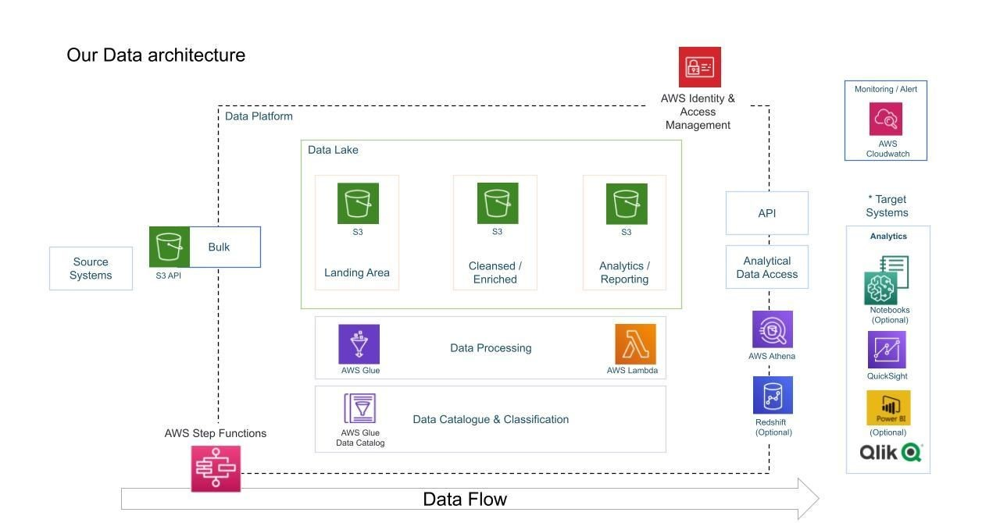


# 📊 YouTube Data Analysis on AWS

This project is an end-to-end data pipeline that ingests, processes, and analyzes YouTube trending video data using AWS services. The goal is to build a scalable, serverless analytics platform using a modern data lake architecture.

---

## 📁 Project Structure

### Data Sources

This Kaggle dataset contains statistics (CSV files) on daily popular YouTube videos over the course of many months. There are up to 200 trending videos published every day for many locations. The data for each region is in its own file. The video title, channel title, publication time, tags, views, likes and dislikes, description, and comment count are among the items included in the data. A category_id field, which differs by area, is also included in the JSON file linked to the region.

https://www.kaggle.com/datasets/datasnaek/youtube-new

- **CSV Files**: Contain trending video metrics per region.
- **JSON Files**: Contain video category metadata (e.g., category names and IDs).
- Both data types are partitioned by **region**.

---

## 🛠️ Tools & Services Used

| Layer            | Service               | Description                                   |
|------------------|------------------------|-----------------------------------------------|
| Storage          | Amazon S3              | Stores raw, processed, and analytical datasets |
| Processing       | AWS Glue, AWS Lambda   | Serverless ETL and transformation              |
| Metadata Catalog | AWS Glue Data Catalog  | Stores schema for Athena and QuickSight        |
| Query Layer      | AWS Athena             | SQL-based data exploration                     |
| Visualization    | Amazon QuickSight      | Interactive dashboards and analysis            |
| Monitoring       | Amazon CloudWatch      | Logs, metrics, and alerting                    |
| Access Control   | AWS IAM                | Identity and permission management             |
---

## 🔄 Data Flow Overview

1. **Data Ingestion**
   - Raw JSON and CSV files are uploaded to the **Landing Area** of S3.
   - Files are partitioned by `region`.

2. **Event-driven JSON Processing**
   - An **AWS Lambda** function is triggered on object creation in S3.
   - The function:
     - Converts JSON to **Parquet** using **AWS Wrangler**.
     - Updates the **Glue Data Catalog**.

3. **Batch CSV ETL Job**
   - An **AWS Glue ETL Job**:
     - Converts CSV to **Parquet**.
     - Performs schema transformation to align with JSON structure.
     - Writes to the **Cleansed Layer** in S3.
     - Updates **Glue Catalog**.

4. **Join & Partitioning**
   - **AWS Glue Studio** job joins JSON and CSV data on `category_id`.
   - Resulting dataset is partitioned by `region` and `category_id`.

5. **Query & Analytics**
   - Final dataset is queried via **Athena**.
   - Interactive dashboards are built using **QuickSight**.

---

## 📁 Directory Layout

```
youtube-aws-etl/
├── data/
├── snippets/
├── src/
│   ├── data_exploration.ipynb
│   ├── extract_lambda.py
│   ├── s3_cli_command.sh
│   └── transform_pyspark.py
├── architecture.jpeg
└── README.md

```

---

## 📊 Sample Analyses

Here are some key insights enabled by the pipeline:

- 📈 **Top Trending Categories by Region**
- 🎥 **Most Engaged Videos** (based on likes/comments per view)
- 📅 **Trending Duration** vs. **Publish Time**
- 📉 **Effect of Ratings/Comments Disabled** on performance
- ?? **Tag Frequency Analysis** (after tag explosion)

---

## 🔐 Security & Governance

- IAM roles and fine-grained S3 permissions are used for service access.
- Optional use of **Lake Formation** for row- and column-level access control.

---

## 🧪 Future Enhancements

- Integrate **schema validation** with AWS Deequ or Great Expectations.
- Use **Apache Iceberg** or **Delta Lake** for advanced table versioning and upserts.
- Automate deployment via **CloudFormation** or **Terraform**.
- Integrate with **CI/CD** using CodePipeline or GitHub Actions.

---

## 📷 Architecture Diagram



---

## 🚀 Getting Started

### Prerequisites

- AWS Account with access to:
  - S3
  - AWS Glue
  - AWS Lambda
  - Athena
  - QuickSight

### Steps

1. Upload raw data (JSON/CSV) to S3 `landing/` bucket.
2. Deploy Lambda and Glue Jobs (use provided scripts).
3. Run initial Glue Crawlers to catalog data.
4. Use Athena to validate schemas and transformations.
5. Create QuickSight dashboards for analysis.

---


